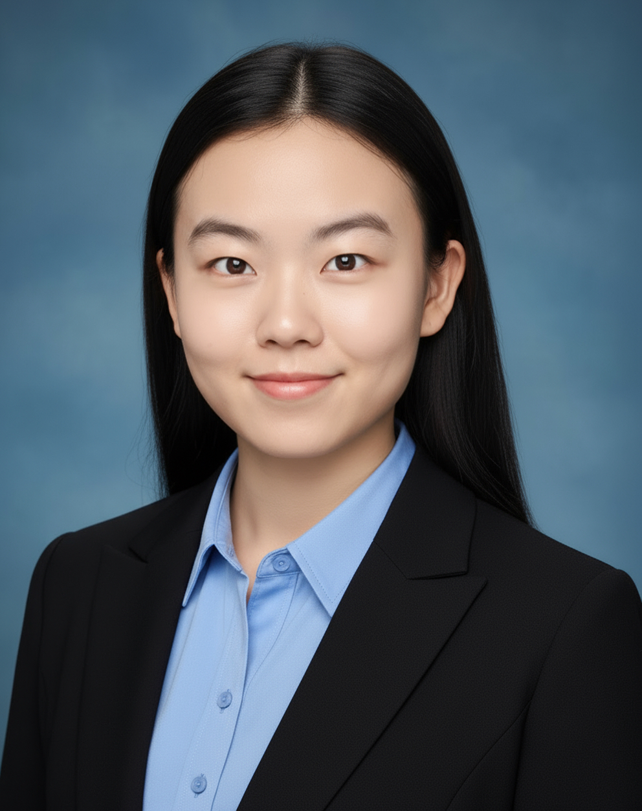

We are a team based in the [School of Computing, National University of Singapore](https://www.comp.nus.edu.sg).

You can reach us at the email `seer[at]comp.nus.edu.sg`

## Project team

### Song Haofeng

[[github](https://github.com/Haofeng125)]

* Role: Developer

### Lang Jiaqi🍀

[[github](https://github.com/lang-jiaqi?tab=repositories)]

* Role: Developer

### Johnny Doe

[[github](http://github.com/johndoe)] [[portfolio](team/johndoe.md)]

* Role: Developer
* Responsibilities: Data

### Jean Doe

[[github](http://github.com/johndoe)]
[[portfolio](team/johndoe.md)]

* Role: Developer
* Responsibilities: Dev Ops + Threading

### Chirla Sai

[[github](https://github.com/chirlasai)]

* Role: Developer
* Responsibilities: UI
