* Table of Contents
<!-- TOC -->
  * [**Acknowledgements**](#acknowledgements)
  * [**Setting up, getting started**](#setting-up-getting-started)
  * [**Design**](#design)
    * [Architecture](#architecture)
    * [UI component](#ui-component)
    * [Logic component](#logic-component)
    * [Model component](#model-component)
    * [Storage component](#storage-component)
    * [Common classes](#common-classes)
  * [**Implementation**](#implementation)
    * [Add feature](#add-feature)
    * [Attach feature](#attach-feature)
    * [Delete feature](#delete-feature)
    * [Update feature](#update-feature)
    * [Find feature](#find-feature)
    * [Export feature](#export-feature)
    * [Clear feature](#clear-feature)
    * [List feature](#list-feature)
    * [Help feature](#help-feature)
    * [Exit feature](#exit-feature)
    * [Undo/redo feature](#undoredo-feature)
      * [Design considerations:](#design-considerations)
    * [\[Proposed\] Data archiving](#proposed-data-archiving)
  * [**Documentation, logging, testing, configuration, dev-ops**](#documentation-logging-testing-configuration-dev-ops)
  * [**Appendix: Requirements**](#appendix-requirements)
    * [Product scope](#product-scope)
    * [User stories](#user-stories)
    * [Use cases](#use-cases)
  * [Non-Functional Requirements](#non-functional-requirements)
    * [Compatibility](#compatibility)
    * [Performance](#performance)
    * [Usability](#usability)
    * [Reliability](#reliability)
    * [Maintainability](#maintainability)
    * [Portability](#portability)
    * [Glossary](#glossary)
  * [**Appendix: Instructions for manual testing**](#appendix-instructions-for-manual-testing)
    * [Test setup](#test-setup)
    * [Launch, shutdown, and UI state](#launch-shutdown-and-ui-state)
    * [Command parsing and basic validation](#command-parsing-and-basic-validation)
    * [Feature-level test cases](#feature-level-test-cases)
      * [Add](#add)
      * [Attach](#attach)
      * [Update](#update)
      * [Find and list interaction](#find-and-list-interaction)
      * [Delete](#delete)
      * [Export](#export)
      * [Clear](#clear)
      * [Help](#help)
      * [Undo](#undo)
    * [Data persistence and recovery tests](#data-persistence-and-recovery-tests)
    * [Regression checklist (quick pass before release)](#regression-checklist-quick-pass-before-release)
<!-- TOC -->

---

## **Acknowledgements**

* This project is based on the [AddressBook Level-3](https://se-education.org/addressbook-level3/) application.
* Class names were renamed from AB3 defaults to CatPals-related names with the help of [Cursor](https://www.cursor.com/) to improve development efficiency(to help us focus on functional code development)

---

## **Setting up, getting started**

Refer to the guide [_Setting up and getting started_](SettingUp.md).

---

## **Design**

<div markdown="span" class="alert alert-primary">

:bulb: **Tip:** The `.puml` files used to create diagrams are in this document `docs/diagrams` folder. Refer to the [_PlantUML Tutorial_ at se-edu/guides](https://se-education.org/guides/tutorials/plantUml.html) to learn how to create and edit diagrams.

</div>

### Architecture


The ***Architecture Diagram*** given above explains the high-level design of the App.

Given below is a quick overview of main components and how they interact with each other.

**Main components of the architecture**

**`Main`** (consisting of classes [`Main`](https://github.com/AY2526S2-CS2103T-T16-3/tp/blob/master/src/main/java/seedu/address/Main.java) and [`MainApp`](https://github.com/AY2526S2-CS2103T-T16-3/tp/blob/master/src/main/java/seedu/address/MainApp.java)) is in charge of the app launch and shut down.

* At app launch, it initializes the other components in the correct sequence, and connects them up with each other.
* At shut down, it shuts down the other components and invokes cleanup methods where necessary.

The bulk of the app's work is done by the following four components:

* [**`UI`**](#ui-component): The UI of the App.
* [**`Logic`**](#logic-component): The command executor.
* [**`Model`**](#model-component): Holds the data of the App in memory.
* [**`Storage`**](#storage-component): Reads data from, and writes data to, the hard disk.

[**`Commons`**](#common-classes) represents a collection of classes used by multiple other components.

**How the architecture components interact with each other**

The *Sequence Diagram* below shows how the components interact with each other for the scenario where the user issues the command `delete 1`.


Each of the four main components (also shown in the diagram above),

* defines its *API* in an `interface` with the same name as the Component.
* implements its functionality using a concrete `{Component Name}Manager` class (which follows the corresponding API `interface` mentioned in the previous point.

For example, the `Logic` component defines its API in the `Logic.java` interface and implements its functionality using the `LogicManager.java` class which follows the `Logic` interface. Other components interact with a given component through its interface rather than the concrete class (reason: to prevent outside component's being coupled to the implementation of a component), as illustrated in the (partial) class diagram below.

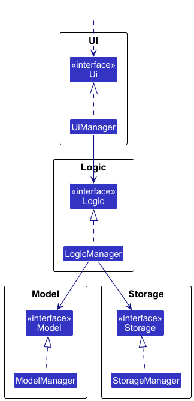

The sections below give more details of each component.

### UI component

The **API** of this component is specified in [`Ui.java`](https://github.com/AY2526S2-CS2103T-T16-3/tp/blob/master/src/main/java/seedu/address/ui/Ui.java)


The UI consists of a `MainWindow` that is made up of parts e.g. `CommandBox`, `ResultDisplay`, `CatListPanel`, `CatDetailPanel`, `StatusBarFooter` etc. All these, including the `MainWindow`, inherit from the abstract `UiPart` class which captures the commonalities between classes that represent parts of the visible GUI. A `SplashScreen` is also shown on startup before the `MainWindow` is initialised; it does not extend `UiPart`.

The `UI` component uses the JavaFx UI framework. The layout of these UI parts are defined in matching `.fxml` files that are in the `src/main/resources/view` folder. For example, the layout of the [`MainWindow`](https://github.com/AY2526S2-CS2103T-T16-3/tp/blob/master/src/main/java/seedu/address/ui/MainWindow.java) is specified in [`MainWindow.fxml`](https://github.com/AY2526S2-CS2103T-T16-3/tp/blob/master/src/main/resources/view/MainWindow.fxml)

The sequence diagram below illustrates how the UI handles a user command:


The `UI` component,

* executes user commands using the `Logic` component.
* listens for changes to `Model` data so that the UI can be updated with the modified data.
* keeps a reference to the `Logic` component, because the `UI` relies on the `Logic` to execute commands.
* depends on some classes in the `Model` component, as it displays `Cat` objects residing in the `Model`.

### Logic component

**API** : [`Logic.java`](https://github.com/AY2526S2-CS2103T-T16-3/tp/blob/master/src/main/java/seedu/address/logic/Logic.java)

Here's a (partial) class diagram of the `Logic` component:

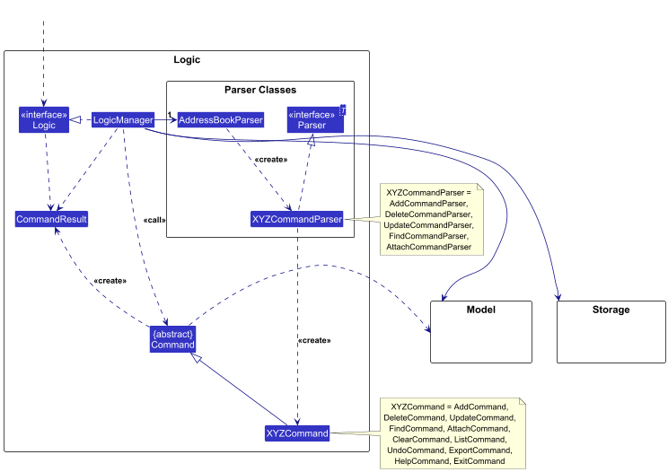

The sequence diagram below illustrates the interactions within the `Logic` component, taking `execute("delete 1")` API call as an example.


<div markdown="span" class="alert alert-info">:information_source: **Note:** The lifeline for `DeleteCommandParser` should end at the destroy marker (X) but due to a limitation of PlantUML, the lifeline continues till the end of diagram.
</div>

How the `Logic` component works:

1. When `Logic` is called upon to execute a command, it is passed to an `AddressBookParser` object which in turn creates a parser that matches the command (e.g., `DeleteCommandParser`) and uses it to parse the command.
2. This results in a `Command` object (more precisely, an object of one of its subclasses e.g., `DeleteCommand`) which is executed by the `LogicManager`.
3. The command can communicate with the `Model` when it is executed (e.g. to delete a person).<br>
   Note that although this is shown as a single step in the diagram above (for simplicity), in the code it can take several interactions (between the command object and the `Model`) to achieve.
4. The result of the command execution is encapsulated as a `CommandResult` object which is returned back from `Logic`.

Here are the other classes in `Logic` (omitted from the class diagram above) that are used for parsing a user command:

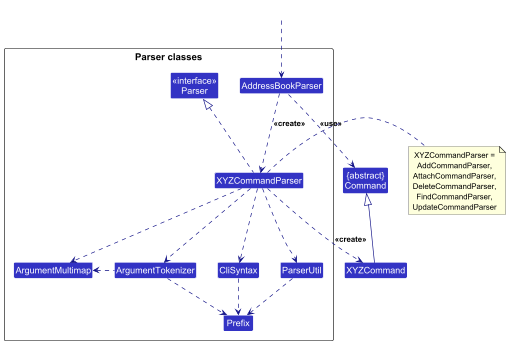

How the parsing works:

* When called upon to parse a user command, the `AddressBookParser` class creates an `XYZCommandParser` (`XYZ` is a placeholder for the specific command name e.g., `AddCommandParser`) which uses the other classes shown above to parse the user command and create a `XYZCommand` object (e.g., `AddCommand`) which the `AddressBookParser` returns back as a `Command` object.
* All `XYZCommandParser` classes (e.g., `AddCommandParser`, `DeleteCommandParser`, ...) inherit from the `Parser` interface so that they can be treated similarly where possible e.g, during testing.

### Model component

**API** : [`Model.java`](https://github.com/AY2526S2-CS2103T-T16-3/tp/blob/master/src/main/java/seedu/address/model/Model.java)


The `Model` component,

* stores the address book data i.e., all `Cat` objects (which are contained in a `UniqueCatList` object).
* stores the currently 'selected' `Cat` objects (e.g., results of a search query) as a separate _filtered_ list which is exposed to outsiders as an unmodifiable `ObservableList<Cat>` that can be 'observed' e.g. the UI can be bound to this list so that the UI automatically updates when the data in the list change.
* stores a `UserPref` object that represents the user’s preferences. This is exposed to the outside as a `ReadOnlyUserPref` objects.
* does not depend on any of the other three components (as the `Model` represents data entities of the domain, they should make sense on their own without depending on other components)

### Storage component

**API** : [`Storage.java`](https://github.com/AY2526S2-CS2103T-T16-3/tp/blob/master/src/main/java/seedu/address/storage/Storage.java)

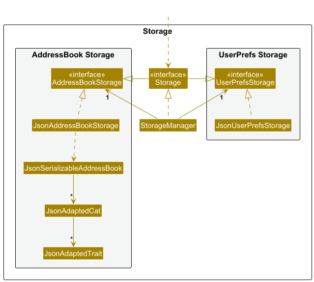

The `Storage` component,

* can save both address book data and user preference data in JSON format, and read them back into corresponding objects.
* inherits from both `AddressBookStorage` and `UserPrefStorage`, which means it can be treated as either one (if only the functionality of only one is needed).
* depends on some classes in the `Model` component (because the `Storage` component's job is to save/retrieve objects that belong to the `Model`)

### Common classes

Classes used by multiple components are in the `seedu.address.commons` package.

---

## **Implementation**

This section describes some noteworthy details on how certain features are implemented.

### Add feature

The `add` command allows users to add a new cat profile to the cat notebook. It is implemented via `AddCommand`, which extends `Command`, and `AddCommandParser`, which parses the user's input.

**Format:** `add n/NAME t/TRAIT l/LOCATION [h/HEALTH_STATUS]`
* `n/NAME`, `t/TRAIT`, and `l/LOCATION` are required.
* `h/HEALTH_STATUS` is optional.
* You can specify up to 3 `t/TRAIT` prefixes, but duplicate traits are not allowed.

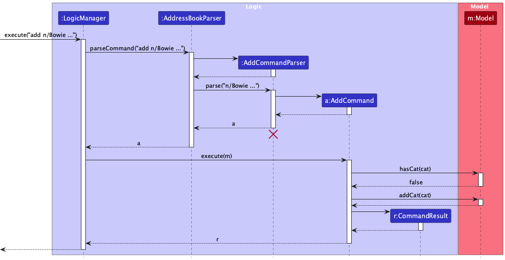

The `add` command works as follows:

1. `LogicManager` receives the command string and delegates parsing to `AddressBookParser`.
2. `AddressBookParser` identifies the `add` keyword and creates an `AddCommandParser`, which parses the remaining arguments (name, trait, location, and optional health status) into a `Cat` object wrapped in an `AddCommand`.
3. `LogicManager` calls `AddCommand#execute(model)`.
4. `AddCommand` checks for duplicates via `Model#hasCat(cat)`. If a cat with the same name already exists, a `CommandException` is thrown.
5. If no duplicate is found, `Model#addCat(cat)` is called to persist the new cat.
6. A `CommandResult` is returned with a success message.


### Attach feature

The `attach` command allows users to attach an image to an existing cat profile, or reset a previously attached image back to auto-detection. It is identified by index or name. It is implemented via `AttachCommand`, which extends `Command`, and `AttachCommandParser`, which parses the user's input.

**Format:**
- `attach INDEX IMAGE_PATH` or `attach CAT_NAME IMAGE_PATH` — attach an image
- `attach INDEX --reset` or `attach CAT_NAME --reset` — clear the explicit image path and fall back to auto-detection

`AttachCommandParser` splits on the **last space** to separate the identifier from the image path or `--reset` flag. This allows cat names with spaces (e.g. `Snowy White`) to be used as identifiers.

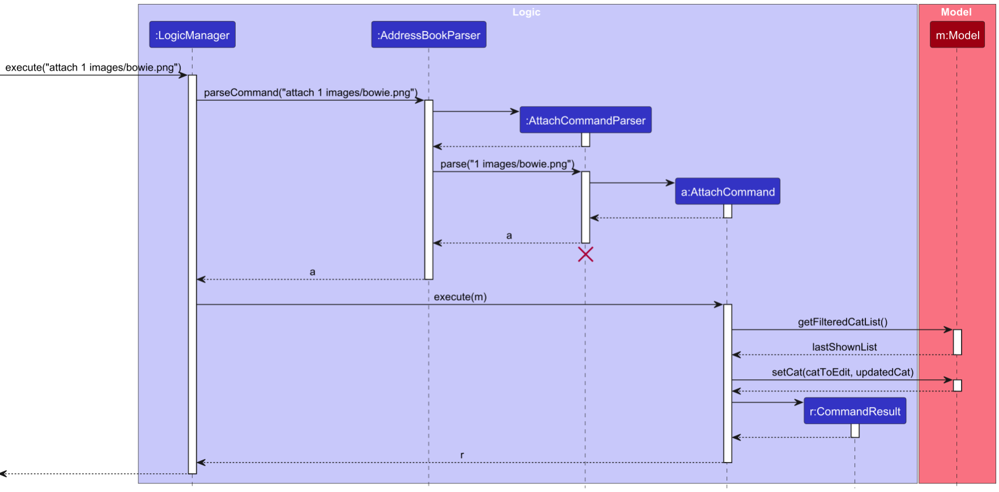

The `attach` command works as follows:

1. `LogicManager` receives the command string and delegates parsing to `AddressBookParser`.
2. `AddressBookParser` identifies the `attach` keyword and creates an `AttachCommandParser`, which splits the arguments on the last space. If the last token is `--reset`, a reset `AttachCommand` is created (no image path). Otherwise, the last token is parsed as an image path.
3. `LogicManager` calls `AttachCommand#execute(model)`.
4. If this is **not** a reset, `AttachCommand` verifies that the image file exists on disk. If not, a `CommandException` is thrown.
5. The target cat is resolved:
   - If an index was given, the cat is retrieved from the filtered list via `Model#getFilteredCatList()`. An out-of-bounds index throws a `CommandException`.
   - If a name was given, the cat is searched case-insensitively across the full cat list via `Model#getAddressBook()`. A missing name throws a `CommandException`.
6. A new `Cat` object is constructed with the updated image path (or an empty `CatImage` for reset), and `Model#setCat(catToEdit, updatedCat)` is called.
7. A `CommandResult` is returned with a success message (`MESSAGE_ATTACH_SUCCESS` or `MESSAGE_RESET_SUCCESS`).

<div markdown="span" class="alert alert-info">:information_source: **Note:** After a reset, CatPals falls back to auto-detection — it looks for a file named after the cat (e.g. `images/Bowie.png`) in the `images/` folder. Both `attach` and `attach --reset` are undoable.
</div>


### Delete feature

The `delete` command allows users to remove an existing cat profile from the cat notebook, identified by index or name. It is implemented via `DeleteCommand`, which extends `Command`, and `DeleteCommandParser`, which parses the user's input.

**Format:** `delete INDEX` or `delete CAT_NAME`

The `delete` command works as follows:

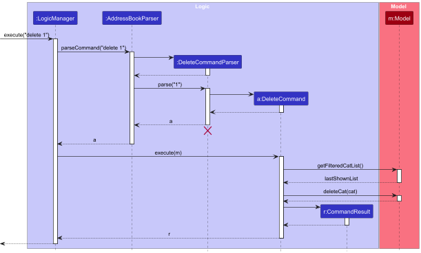

1. `LogicManager` receives the command string and delegates parsing to `AddressBookParser`.
2. `AddressBookParser` identifies the `delete` keyword and creates a `DeleteCommandParser`, which attempts to parse the argument as an index first. If that fails, it treats the argument as a cat name (case-sensitive).
3. `LogicManager` calls `DeleteCommand#execute(model)`.
4. `DeleteCommand` retrieves the current filtered cat list via `Model#getFilteredCatList()`.
5. The target cat is resolved:
   - If an index was given, the cat at that position is retrieved. An out-of-bounds index throws a `CommandException`.
   - If a name was given, the cat is located by exact name match. If no match is found, a `CommandException` is thrown.
6. `Model#deleteCat(cat)` is called to remove the cat from the address book.
7. A `CommandResult` is returned with a success message.

### Update feature

The `update` command allows users to change an existing cat’s name, traits, location, or health status. The cat is identified either by **index** (position in the **currently displayed** list) or by **name** (matched against the full cat list). It is implemented via `UpdateCommand`, which extends `Command`, and `UpdateCommandParser`, which parses the user’s input.

**Format:** `update CAT_NAME [n/NAME] [t/TRAIT]... [l/LOCATION] [h/HEALTH_STATUS]` **or** `update INDEX [n/NAME] [t/TRAIT]... [l/LOCATION] [h/HEALTH_STATUS]`

* At least one of `n/`, `t/`, `l/`, or `h/` must be present; otherwise a `ParseException` is thrown with `UpdateCommand.MESSAGE_NOT_EDITED`.
* `n/`, `t/`, `l/`, and `h/` are **case-insensitive** for the `update` command only (e.g. `N/` and `n/` are treated the same). This is done in `UpdateCommandParser#normalizeUpdatePrefixes` before tokenization.
* Duplicate `n/`, `l/`, or `h/` prefixes in one command are rejected via `ArgumentMultimap#verifyNoDuplicatePrefixesFor`.
* Multiple `t/TRAIT` prefixes are allowed (subject to the usual cap of three traits and no duplicates within the parsed list).
* Supplying `t/` **replaces** the cat’s entire trait list with the traits given in that command. To keep existing traits, the user must include them again alongside any new ones. A lone `t/` with no value clears all traits (parsed as an empty trait list).
* If the target is specified by **name**, lookup is **case-insensitive** (`equalsIgnoreCase` on the full name). If no cat matches, a `CommandException` is thrown with `UpdateCommand.MESSAGE_INVALID_CAT_NAME`.
* If the target is specified by **index**, it refers to the **filtered** list (`Model#getFilteredCatList()`). An out-of-bounds index results in `Messages.MESSAGE_INVALID_CAT_DISPLAYED_INDEX`.
* After applying edits, if the updated cat would duplicate another cat’s identity (same name as a different entry), `Model#hasCat` causes a `CommandException` with `UpdateCommand.MESSAGE_DUPLICATE_CAT`.

The following sequence diagram shows how an update operation is carried out:

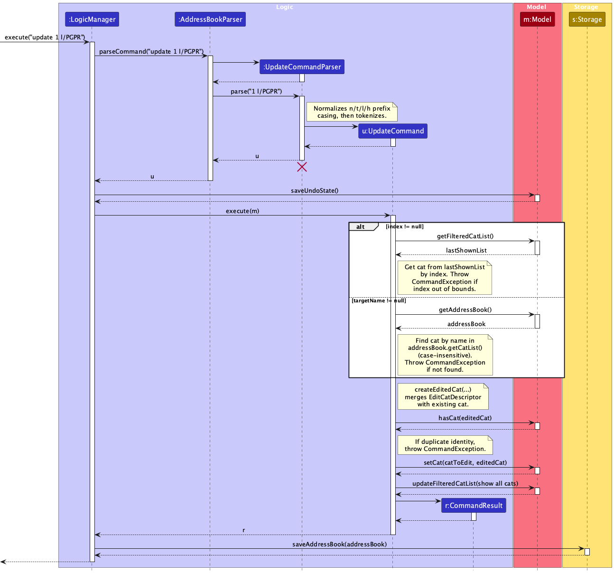

<div markdown="span" class="alert alert-info">:information_source: **Note:** The lifeline for `UpdateCommandParser` should end at the destroy marker (X) but due to a limitation of PlantUML, the lifeline continues till the end of diagram.
</div>

The `update` command works as follows:

1. `LogicManager` receives the command string and delegates parsing to `AddressBookParser`.
2. `AddressBookParser` identifies the `update` keyword and creates an `UpdateCommandParser`, which normalizes prefix casing, tokenizes arguments, and parses the preamble as either an index or a valid `Name`, together with an `EditCatDescriptor` for the fields to change.
3. `LogicManager` calls `UpdateCommand#execute(model)`.
4. `UpdateCommand` resolves the cat to edit from the filtered list (by index) or from the address book’s full cat list (by name), then builds an updated `Cat` via `createEditedCat`, merging descriptor fields with the existing cat.
5. Duplicate-name checks and `Model#setCat` are applied; the filtered list is reset to show all cats (`PREDICATE_SHOW_ALL_CATS`).
6. A `CommandResult` is returned with a success message.

### Find feature

The `find` command updates which cats are shown in the UI by applying a `CatContainsKeywordsPredicate` over the address book. It is implemented via `FindCommand` and `FindCommandParser`.

**Format:** `find [n/NAME]... [l/LOCATION]... [t/TRAIT]... [h/HEALTH_STATUS]...` — at least one of `n/`, `l/`, `t/`, or `h/` must be present, and there must be **no preamble** (anything before the first prefix causes a parse error).

* `FindCommandParser` normalizes `n/t/l/h` prefix casing (case-insensitive), then tokenizes and validates keywords (non-empty, single token per value).
* `FindCommand#execute` calls `Model#updateFilteredCatList(predicate)` with a `CatContainsKeywordsPredicate`. If the filtered list is empty, `FindCommand.MESSAGE_NO_MATCH` is returned; otherwise an overview message is shown.

The following sequence diagram shows how a find operation is carried out:

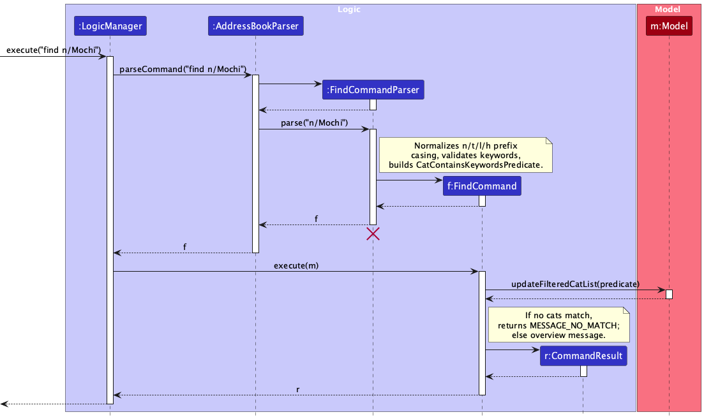

<div markdown="span" class="alert alert-info">:information_source: **Note:** The lifeline for `FindCommandParser` should end at the destroy marker (X) but due to a limitation of PlantUML, the lifeline continues till the end of diagram.
</div>

The `find` command works as follows:

1. `LogicManager` receives the command string and delegates parsing to `AddressBookParser`.
2. `AddressBookParser` identifies the `find` keyword and creates a `FindCommandParser`, which parses prefixed keywords into a `CatContainsKeywordsPredicate` wrapped in a `FindCommand`.
3. `LogicManager` calls `FindCommand#execute(model)`.
4. `FindCommand` updates the filtered cat list via `Model#updateFilteredCatList(predicate)`.
5. A `CommandResult` is returned (either a “no match” message or a listed-cats overview).

### Export feature

The export feature allows users to export the currently displayed cat list to an HTML file. It is implemented via `ExportCommand`, which extends `Command`, and `ExportCommandParser`, which parses the optional title/filename argument.

**Format:** `export [TITLE]`
* If `TITLE` is omitted, the file is saved as `export.html` with the heading "Cat List".
* If `TITLE` is provided (e.g. `export Utown Cats`), spaces are replaced with hyphens for the filename (`utown-cats.html`), and the original text is used as the page heading (`Utown Cats`).
* `TITLE` must not contain any of the characters `\ / : * ? " < > |`; otherwise a `ParseException` is thrown.

The following sequence diagram shows how an export operation is carried out:

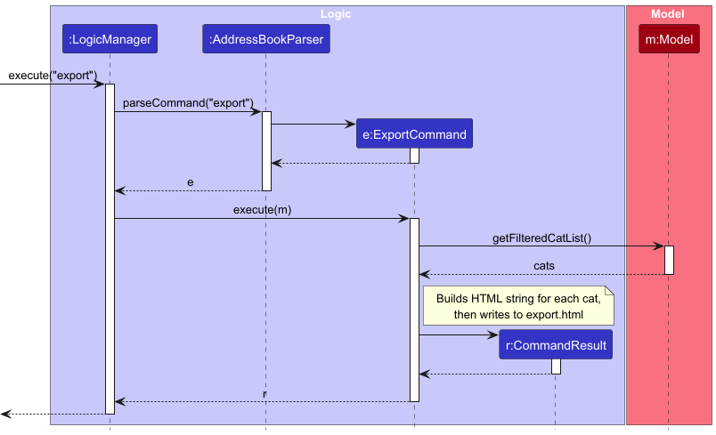

The `export` command works as follows:

1. `LogicManager` receives the command string and delegates parsing to `AddressBookParser`.
2. `AddressBookParser` identifies the `export` keyword and creates an `ExportCommandParser`, which trims the remaining arguments. If empty, a default `ExportCommand` is returned. Otherwise, spaces are replaced with hyphens to form the filename and the original trimmed text becomes the page title; invalid filename characters cause a `ParseException`.
3. `LogicManager` calls `ExportCommand#execute(model)`.
4. `ExportCommand` retrieves the currently filtered cat list via `Model#getFilteredCatList()`. This respects any active `find` filters — only the cats currently shown in the UI are exported.
5. An HTML string is built for each cat and written to `<filename>.html` in the application's working directory.
6. A `CommandResult` is returned indicating how many cats were exported and the output filename.

<div markdown="span" class="alert alert-info">:information_source: **Note:** `export` is not undoable — it does not modify address book data, so executing `export` clears any previously saved undo state.
</div>

### Clear feature

The `clear` command removes all cats from the address book by replacing it with an empty `AddressBook`. It is implemented via `ClearCommand`, which extends `Command`. There is no dedicated parser — `AddressBookParser` instantiates `ClearCommand` directly when the user types `clear` (any extra text after the command word is not parsed and does not affect execution).

The following sequence diagram shows how a clear operation is carried out:

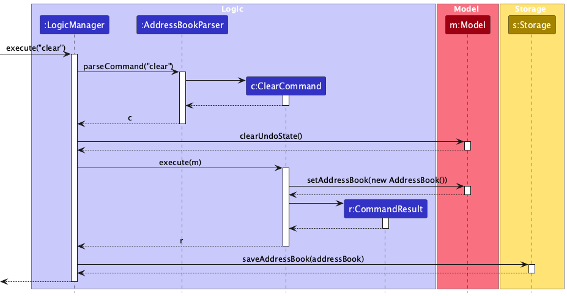

The `clear` command works as follows:

1. `LogicManager` receives the command string and delegates parsing to `AddressBookParser`.
2. `AddressBookParser` creates a `ClearCommand`.
3. Before execution, `LogicManager` clears any saved undo state via `Model#clearUndoState()` (since `clear` is not treated as an undoable single-cat command in the same way as `add` / `delete` / `update` / `attach`).
4. `LogicManager` calls `ClearCommand#execute(model)`.
5. `ClearCommand` calls `Model#setAddressBook(new AddressBook())`, removing all cat entries.
6. A `CommandResult` is returned with a success message.
7. `LogicManager` persists the empty address book via `Storage#saveAddressBook`.

### List feature

The `list` command shows all cats in the address book. It is implemented via `ListCommand`, which extends `Command`, and requires no dedicated parser class.

Unlike most no-argument commands, `list` rejects extra parameters instead of silently ignoring them. The check is performed in `AddressBookParser`: if the `arguments` string (everything after the command word) is non-empty after trimming, a `ParseException` is thrown with `ListCommand.MESSAGE_EXTRA_ARGS`, which reads:

```
list does not take extra parameters.
Did you just mean: list
```

**Implementation flow:**

1. User types e.g. `list foo` and presses Enter.
2. `AddressBookParser#parseCommand()` splits the input into `commandWord = "list"` and `arguments = " foo"`.
3. `arguments.trim()` is non-empty, so a `ParseException` is thrown with `ListCommand.MESSAGE_EXTRA_ARGS`.
4. The error message is displayed to the user; no state change occurs.

If the user types exactly `list` (no arguments), `arguments` is an empty string, the check passes, and `ListCommand` is returned and executed normally.

### Help feature

The `help` command shows usage information by returning a `CommandResult` that signals the UI to open the help window. It is implemented via `HelpCommand`, which extends `Command`. There is no dedicated parser — `AddressBookParser` instantiates `HelpCommand` directly when the user types `help`.

The following sequence diagram shows how the help command is handled:

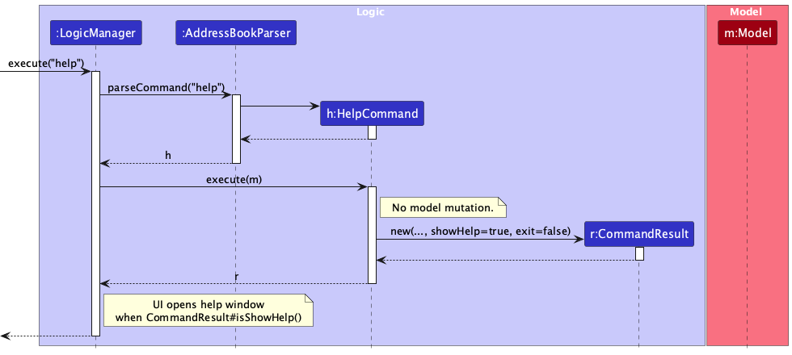

The `help` command works as follows:

1. `LogicManager` receives the command string and delegates parsing to `AddressBookParser`.
2. `AddressBookParser` creates a `HelpCommand` with no arguments.
3. `LogicManager` calls `HelpCommand#execute(model)` (the model is not modified).
4. A `CommandResult` is returned with `showHelp` set to true; the UI then opens the help window.

### Exit feature

The `exit` command shuts down the application. It is implemented via `ExitCommand`, which extends `Command`. There is no dedicated parser — `AddressBookParser` instantiates `ExitCommand` directly when the user types `exit`.

The following sequence diagram shows how the exit command is handled:

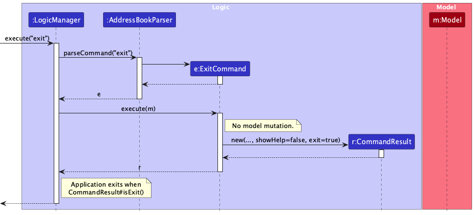

The `exit` command works as follows:

1. `LogicManager` receives the command string and delegates parsing to `AddressBookParser`.
2. `AddressBookParser` creates an `ExitCommand` with no arguments.
3. `LogicManager` calls `ExitCommand#execute(model)` (the model is not modified).
4. A `CommandResult` is returned with `exit` set to true; the UI then terminates the application.

### Undo/redo feature

The proposed undo/redo mechanism is facilitated by `VersionedAddressBook`. It extends `AddressBook` with an undo/redo history, stored internally as an `addressBookStateList` and `currentStatePointer`. Additionally, it implements the following operations:

* `VersionedAddressBook#commit()` — Saves the current address book state in its history.
* `VersionedAddressBook#undo()` — Restores the previous address book state from its history.
* `VersionedAddressBook#redo()` — Restores a previously undone address book state from its history.

These operations are exposed in the `Model` interface as `Model#commitAddressBook()`, `Model#undoAddressBook()` and `Model#redoAddressBook()` respectively.

Given below is an example usage scenario and how the undo/redo mechanism behaves at each step.

Step 1. The user launches the application for the first time. The `VersionedAddressBook` will be initialized with the initial address book state, and the `currentStatePointer` pointing to that single address book state.


Step 2. The user executes `delete 5` command to delete the 5th person in the address book. The `delete` command calls `Model#commitAddressBook()`, causing the modified state of the address book after the `delete 5` command executes to be saved in the `addressBookStateList`, and the `currentStatePointer` is shifted to the newly inserted address book state.


Step 3. The user executes `add n/David t/Tabby l/Utown …` to add a new cat. The `add` command also calls `Model#commitAddressBook()`, causing another modified address book state to be saved into the `addressBookStateList`.


<div markdown="span" class="alert alert-info">:information_source: **Note:** If a command fails its execution, it will not call `Model#commitAddressBook()`, so the address book state will not be saved into the `addressBookStateList`.

</div>

Step 4. The user now decides that adding the person was a mistake, and decides to undo that action by executing the `undo` command. The `undo` command will call `Model#undoAddressBook()`, which will shift the `currentStatePointer` once to the left, pointing it to the previous address book state, and restores the address book to that state.


<div markdown="span" class="alert alert-info">:information_source: **Note:** If the `currentStatePointer` is at index 0, pointing to the initial AddressBook state, then there are no previous AddressBook states to restore. The `undo` command uses `Model#canUndoAddressBook()` to check if this is the case. If so, it will return an error to the user rather
than attempting to perform the undo.

</div>

The following sequence diagram shows how an undo operation goes through the `UI` and `Logic` components. Before the undo is executed, `MainWindow` calls `Logic#canUndo()` to check whether there is a saved state to restore. If there is, a confirmation dialog is shown. The undo is only carried out if the user confirms.


<div markdown="span" class="alert alert-info">:information_source: **Note:** The lifeline for `UndoCommand` should end at the destroy marker (X) but due to a limitation of PlantUML, the lifeline reaches the end of diagram.

</div>

Similarly, how an undo operation goes through the `Model` component is shown below:


The `redo` command does the opposite — it calls `Model#redoAddressBook()`, which shifts the `currentStatePointer` once to the right, pointing to the previously undone state, and restores the address book to that state.

<div markdown="span" class="alert alert-info">:information_source: **Note:** If the `currentStatePointer` is at index `addressBookStateList.size() - 1`, pointing to the latest address book state, then there are no undone AddressBook states to restore. The `redo` command uses `Model#canRedoAddressBook()` to check if this is the case. If so, it will return an error to the user rather than attempting to perform the redo.

</div>

Step 5. The user then decides to execute the command `list`. Commands that do not modify the address book, such as `list`, will usually not call `Model#commitAddressBook()`, `Model#undoAddressBook()` or `Model#redoAddressBook()`. Thus, the `addressBookStateList` remains unchanged.


Step 6. The user executes `clear`, which calls `Model#commitAddressBook()`. Since the `currentStatePointer` is not pointing at the end of the `addressBookStateList`, all address book states after the `currentStatePointer` will be purged. Reason: It no longer makes sense to redo the `add n/David t/Tabby l/Utown …` command. This is the behavior that most modern desktop applications follow.


The following activity diagram summarizes what happens when a user executes a new command:


#### Design considerations:

**Aspect: How undo & redo executes:**

* **Alternative 1 (current choice):** Saves the entire address book.

  * Pros: Easy to implement.
  * Cons: May have performance issues in terms of memory usage.
* **Alternative 2:** Individual command knows how to undo/redo by
  itself.

  * Pros: Will use less memory (e.g. for `delete`, just save the person being deleted).
  * Cons: We must ensure that the implementation of each individual command are correct.

---

## **Documentation, logging, testing, configuration, dev-ops**

* [Documentation guide](Documentation.md)
* [Testing guide](Testing.md)
* [Logging guide](Logging.md)
* [Configuration guide](Configuration.md)
* [DevOps guide](DevOps.md)

---

## **Appendix: Requirements**

### Product scope

**Target user profile**:

* is a member of NUS Cate Cafe CCA
* has a need to manage a significant number of stray cats in NUS Campus
* prefer desktop apps over other types
* can type fast
* prefers typing to mouse interactions
* is reasonably comfortable using CLI apps

**Value proposition**:

Provides fast, CLI-optimized access to information of stray cats living in NUS campus so volunteers can reliably identify cats and keep key status details up to date. Designed for personal or small-team use; not a veterinary medical system, shelter operations tool, or public registry.

### User stories

Priorities:
MVP - `* * * *`, High (must have) - `* * *`, Medium (nice to have) - `* *`, Low (unlikely to have) - `*`


| Priority   | As a …                            | I want to …                                                                                                 | So that I can…                                                                        |
| ---------- | ---------------------------------- | ------------------------------------------------------------------------------------------------------------ | -------------------------------------------------------------------------------------- |
| `* * * * ` | regular feeder                     | search a cat by name/alias in the CLI                                                                        | identify it quickly on the spot                                                        |
| `* * * *`  | volunteer                          | update a cat’s key status fields (e.g., sterilised/ear-tipped, friendliness, usual area)                    | our data stays accurate for small-team coordination                                    |
| `* * * *`  | volunteer                          | add cat entries                                                                                              | keep the record of a newly-found stray cat                                             |
| `* * * *`  | user                               | delete a cat profile                                                                                         | remove duplicate entries or data errors to keep the database clean                     |
| `* * *`    | frequent user                      | use short-hand flags (e.g., -n for name, -t for territory)                                                   | type faster                                                                            |
| `* * *`    | volunteer                          | add and search by multiple identifiers (alias, coat color, landmark)                                         | still find a cat when I don’t know its name                                           |
| `* * *`    | volunteer updating a cat’s record | prompted by the CLI for confirmation before applying changes                                                 | not accidentally overwrite important information                                       |
| `* * *`    | volunteer                          | export the list of cats data stored in this app                                                              | get a physical copy of the list                                                        |
| `* * *`    | volunteer                          | undo or revert my last update                                                                                | be away from the risk where accidental edits permanently corrupt records               |
| `* * *`    | volunteer                          | tag a cat with quick flags (e.g., “shy”, “approachable”, “avoid”)                                      | interact safely and consistently                                                       |
| `* * *`    | user                               | see a quick profile of each cat on the main page                                                             | get an overview of all the cats without diving into details                            |
| `* * *`    | new user                           | run a guided “first-time” CLI help command                                                                 | learn the workflow quickly                                                             |
| `* * *`    | volunteer                          | filter cats by certain attributes                                                                            | get the information of a group of cats that share some similarities                    |
| `* * *`    | volunteer                          | attach an image of the cat                                                                                   | see how the cat is looked like in the most directly way                                |
| `* *`      | user                               | use a personal account and a corresponding key to login                                                      | be away from the issue that unauthorized users will have access to this system         |
| `* *`      | user                               | attach a link that keeps an archive of the cat (videos, more pictures) for each cat recorded in this system | more information of cats can be retrieved without taking up storage inside of this app |
| `* *`      | commitee member                    | edit a cat’s profile to change their status to "adopted"                                                    | stop deploying resources for cats that are no longer on campus                         |
| `* *`      | volunteer                          | mark a cat's entry grey to indicate that the cat has unfortunately died                                      | show respect and R.I.P to cats                                                         |
| `* *`      | first time user                    | learn how to use this app with a tutorial provided when I first open it                                      | get myself familiar without exploring by myself                                        |
| `*`        | volunteer                          | auto-identify a cat from a photo using on-device recognition                                                 | be free from typing names at all                                                       |
| `*`        | volunteer                          | see a list of "Missing in Action" cat                                                                        | rescue them in time                                                                    |
| `*`        | volunteer                          | use fuzzy search and typo tolerance                                                                          | find cats quickly even with imperfect spelling                                         |
| `*`        | volunteer                          | “favorite” a set of cats                                                                                   | pull up my usual watchlist with one command                                            |
| `*`        | volunteer                          | create a “needs follow-up” note (non-medical)                                                              | be in the situation where the next person knows what to check without guessing         |
| `*`        | volunteer                          | maintain a “cat family tree / social graph” (friendships, rivalries, territories)                          | understand colony dynamics over time                                                   |
| `*`        | volunteer                          | record structured medical observations (symptoms checklist + severity)                                       | get to the concerns consistently (not a diagnosis)                                     |
| `*`        | volunteer                          | log medication administration (drug name, dosage, time, handler)                                             | track the treatment history and thus reduces mistakes                                  |
| `*`        | volunteer                          | get “triage suggestions” based on symptoms                                                                 | know whether to monitor, isolate, or escalate (high-risk, needs careful disclaimers)   |
| `*`        | volunteer                          | use arrow keys (or command history)                                                                          | quickly repeat a previous complex command without re-typing it entirely                |
| `*`        | volunteer                          | keep track of where the cat is last seen (especially if out of its own territory)                            | track the cat in a more detailed way                                                   |

*{More to be added}*

### Use cases

(For all use cases below, the **System** is the `CatPals` app and the **Actor** is the `user`, unless specified otherwise)

**Use case 1 (U1): Add a cat**

**MSS**

1. User requests to add a cat
2. CatPals adds the cat

   Use case ends.

**Extensions**

* 1a. The provided name is blank.

  * 1a1. CatPals shows an error message: "Name must not be blank!".
    Use case ends.
* 1b. The name length exceeds 30 characters.

  * 1b1. CatPals shows an error message: "Name must be no longer than 30 chars!".
    Use case ends.
* 1c. The name contains symbols.

  * 1c1. CatPals shows an error message: "The name must not contain symbols!".
    Use case ends.
* 1c2. The name consists of only numbers (e.g. `123`).

  * 1c2a. CatPals shows an error message: "Name must contain at least one letter and cannot be only numbers!".
    Use case ends.
* 1d. A cat with the same name already exists in CatPals.

  * 1d1. CatPals shows an error message: "The cat name already exists!".
    Use case ends.
* 1e. The trait field is blank.

  * 1e1. CatPals shows an error message: "Your Add command is incomplete. Please enter again.".
    Use case ends.
* 1f. The user inputs more than 3 traits.

  * 1f1. CatPals shows an error message: "You added more than 3 traits to the cat. Please only add up to 3 traits.".
    Use case ends.
* 1g. The user inputs duplicate traits.

  * 1g1. CatPals shows an error message: "You cannot add duplicate traits!".
    Use case ends.
* 1h. The location field is blank.

  * 1h1. CatPals shows an error message: "Location must not be blank!".
    Use case ends.
* 1i. The location length exceeds 50 characters.

  * 1i1. CatPals shows an error message: "Location must be no longer than 50 chars!".
    Use case ends.
* 1j. The user inputs duplicate locations.

  * 1j1. CatPals shows an error message: "You cannot add duplicate locations!".
    Use case ends.

**Use case 2 (U2): Delete a cat**

**MSS**

1. User requests to list cats
2. CatPals shows a list of cats
3. User requests to delete a specific cat in the list
4. CatPals deletes the cat

   Use case ends.

**Extensions**

* 2a. The list is empty.

  Use case ends.
* 3a. The user requests to delete by name.

  * 3a1. The name is blank.
    * 3a1a. CatPals shows an error message: "The info to be deleted must not be blank!".
      Use case ends.
  * 3a2. The name contains symbols.
    * 3a2a. CatPals shows an error message: "The name must not contain symbols!".
      Use case ends.
  * 3a3. The name does not match any cat in CatPals.
    * 3a3a. CatPals shows an error message: "The input name does not match any cat in CatPal. Is there a typo?".
      Use case ends.
* 3b. The user requests to delete by number (index).

  * 3b1. The number is blank.
    * 3b1a. CatPals shows an error message: "The info to be deleted must not be blank!".
      Use case ends.
  * 3b2. The number is out of range (invalid index).
    * 3b2a. CatPals shows an error message: "The input number is out of range. Please try again.".
      Use case resumes at step 2.

**Use case 3 (U3): Search for a cat using its name**

**MSS**

1. User requests to find a specific cat by name
2. CatPals shows all cat profiles that match the search
3. User selects a cat profile from the search results to view its details

   Use case ends.

**Extensions**

* 2a. The list is empty.

  Use case ends.
* 3a. The name is missing for the find command.

  * 3a1. CatPals shows an error message: "Name is missing for this find command.".

    Use case ends.
* 3b. The name contains symbols.

  * 3b1. CatPals shows an error message: "The name must not contain symbols".

    Use case ends.
* 3c. There is no profile with a matching name.

  * 3c1. CatPals shows an error message: "There is no such profile in my records! Is there a typo?".

    Use case ends.

**Use case 4 (U4): Help command**

**MSS**

1. User requests to see the help guide
2. CatPals shows a list of available commands and their formats

   Use case ends.

**Extensions**

* 1a. The help command is typed incorrectly.

  * 1a1. CatPals shows an error message: "No such command found!".

    Use case ends.

**Use case 5 (U5): Update cat status**

**MSS**

1. User requests to list cats
2. CatPals shows a list of cats
3. User requests to update the status (traits, location, or health) of a specific cat in the list
4. CatPals updates the status of the cat

   Use case ends.

**Extensions**

* 2a. The list is empty.

  Use case ends.
* 3a. The user requests to update by name.

  * 3a1. The name is blank.
    * 3a1a. CatPals shows an error message: "The info to be updated must not be blank!".
      Use case ends.
  * 3a2. The name contains symbols.
    * 3a2a. CatPals shows an error message: "The name must not contain symbols!".
      Use case ends.
  * 3a3. The name does not match any cat in CatPals.
    * 3a3a. CatPals shows an error message: "No such profile is found in my records. Please ensure the cat’s name is spelled correctly.".
      Use case ends.
* 3b. The user requests to update by index.

  * 3b1. The index is blank.
    * 3b1a. CatPals shows an error message: "The info to be updated must not be blank!".
      Use case ends.
  * 3b2. The index is out of range (invalid index).
    * 3b2a. CatPals shows an error message: "No such profile is found in my records. Please ensure the cat number is in the range!".
      Use case resumes at step 2.
* 3c. The updated status data is invalid.

  * 3c1. The user inputs more than 3 traits.
    * 3c1a. CatPals shows an error message: "You added more than 3 traits to the cat. Please only add up to 3 traits.".
      Use case ends.
  * 3c2. The user inputs duplicate traits or locations.
    * 3c2a. CatPals shows an error message: "You cannot add duplicate [traits/locations]!".
      Use case ends.

**Use case 6 (U6): Undo last action**

**MSS**

1. User requests to undo the previous command
2. CatPals reverts the last change made to the notebook
3. CatPals shows a success message confirming the restoration

   Use case ends.

**Extensions**

* 1a. There is no previous command to undo.

  * 1a1. CatPals shows an error message: "No more commands to undo!".

    Use case ends.
* 1b. The last command was a "Find" or "List" command (no state change).

  * 1b1. CatPals shows an error message: "Last command did not change data; nothing to undo.".

    Use case ends.

**Use case 7 (U7): Attach an image to a cat profile**

**MSS**

1. User requests to attach an image to a specific cat profile
2. CatPals prompts the user to provide the file path of the image
3. User provides the file path
4. CatPals validates the file path and attaches the image to the cat profile
5. CatPals shows a success message confirming the attachment
   Use case ends.

**Extensions**

* 4a. The provided file path is invalid or the file is not an image.
  * 4a1. CatPals shows an error message: "Invalid file path or unsupported file type. Please provide a valid image file.".
  * 4a2. CatPals prompts the user to provide the file path again.
    Use case resumes at step 3.

**Use case 8 (U8): Export cat data**

**MSS**

1. User requests to export the currently displayed cat list, optionally providing a title (e.g. `export Utown Cats`)
2. CatPals exports the cats to an HTML file named after the title (e.g. `utown-cats.html`), using the title as the page heading
3. CatPals shows a success message indicating how many cats were exported and the output filename

   Use case ends.

**Extensions**

* 1a. No title is provided (user types just `export`).
  * 1a1. CatPals exports to `export.html` with the default heading "Cat List".
    Use case ends.
* 1b. The title contains invalid filename characters (e.g. `\ / : * ? " < > |`).
  * 1b1. CatPals shows an error message listing the disallowed characters.
    Use case ends.

**Use case 9 (U9): Filter cats by traits**

**MSS**

1. User requests to filter cats by specific traits
2. CatPals prompts the user to input the traits to filter by
3. User provides the traits
4. CatPals validates the input and displays a list of cats that match the specified traits.
5. User selects a cat profile from the filtered list to view its details

   Use case ends.

**Extensions**

* 4a. The user inputs invalid traits (e.g., more than 3 traits, duplicate traits).
  * 4a1. CatPals shows an error message: "Invalid traits input. Please provide up to 3 unique traits.".
  * 4a2. CatPals prompts the user to input the traits again.
    Use case resumes at step 2.
* 4b. No cats match the specified traits.
  * 4b1. CatPals shows a message: "No cats found with the specified traits."
    Use case ends.

## Non-Functional Requirements

1. Should work on any _mainstream OS_ as long as it has Java `17` or above installed.
2. Should be able to hold up to 1000 cats without a noticeable sluggishness in performance for typical usage.
3. A user with above average typing speed for regular English text (i.e. not code, not system admin commands) should be able to accomplish most of the tasks faster using commands than using the mouse.

### Compatibility

- Should work on any mainstream OS (Windows, macOS, Linux) as long as Java `17` or above is installed.

### Performance

- Should be able to hold up to 1000 cat records without noticeable sluggishness in performance for typical usage.
- Response time for adding, deleting, or editing a record should be under 1 second.
- Search results should be displayed within 0.5 seconds of input.

### Usability

- A user with above average typing speed for regular English text should be able to accomplish most tasks faster using commands than using the mouse.
- A new user should be able to complete their first cat record entry within 5 minutes.

### Reliability

- Data should be automatically saved after each operation without requiring manual saving.
- Data should be fully recoverable after an unexpected application crash.

### Maintainability

- Adding new fields should not require significant code refactoring.

### Portability

- Should support exporting data in CSV or JSON format for backup or migration purposes.

*{More to be added}*

### Glossary

* **Mainstream OS**: Windows, Linux, Unix, MacOS
* **Private contact detail**: A contact detail that is not meant to be shared with others
* **JavaFX**: A Java library used to build the graphical user interface (GUI) of this application
* **FXML**: An XML-based file format used by JavaFX to define the layout and structure of UI components separately from application logic
* **Component**: A self-contained, replaceable part of the application (e.g., UI, Logic, Model, Storage), each responsible for a distinct concern and communicating with others only through defined interfaces
* **Coupling**: The degree of dependency between components. Low coupling is preferred, as it means changes to one component are less likely to break others
* **Model**: The component that holds all in-memory application data (contacts, user preferences)
* **ObservableList**: A JavaFX list that automatically notifies listeners (such as the UI) when its contents change, enabling the display to refresh without manual intervention
* **Filtered List**: A view of the full contact list showing only entries that match current search criteria. It updates dynamically as the underlying data or filter changes\
* **State/Address book state**: A complete snapshot of the address book's data at a given point in time. Used by the undo/redo feature to restore previous versions
* **Commit (in undo/redo context)**: The act of saving the current address book state into history, analogous to saving a checkpoint. Not related to version control commits
* **Sequence Diagram**: A UML diagram showing how objects interact with each other in a specific time-ordered sequence of method calls
* **Activity diagram**: A UML diagram showing the flow of control through a process, including decision points and parallel actions
* **Class diagram**: A UML diagram showing the structure of classes, their attributes, methods, and relationships (e.g., inheritance, association)
* **MSS**: Main Success Scenario. The primary, happy-path flow of a use case, describing what happens when everything goes as expected with no errors or exceptions
* **PlantUML**: A tool that generates UML diagrams from plain text descriptions. The .puml files in this project define all architectural diagrams
* **Lifeline (in sequence diagrams)**: The vertical dashed line in a sequence diagram representing an object's existence over time. It ends with a destroy marker (X) when the object is no longer needed

---

## **Appendix: Instructions for manual testing**

Given below are instructions to test the app manually.

<div markdown="span" class="alert alert-info">:information_source: **Note:** These instructions only provide a starting point for testers to work on;
testers are expected to do more *exploratory* testing.

</div>

### Test setup

1. Download the latest `catpals.jar` into an empty folder.
2. Ensure Java `17` or above is installed.
3. Launch with `java -jar catpals.jar` from that folder.
4. Ensure `data/addressbook.json` is created after first successful data-changing command.
5. Keep a backup copy of `data/addressbook.json` before destructive tests (`clear`, malformed file tests).

### Launch, shutdown, and UI state

1. Initial launch

   1. Run `java -jar catpals.jar`.
   2. Expected: splash screen appears, then main window opens after pressing `Space`.
   3. Expected: sample cat entries are shown on first run.
2. Window preference persistence

   1. Resize and reposition the app window.
   2. Close and relaunch.
   3. Expected: window size and position are restored.
3. Keyboard navigation

   1. Use `Up` / `Down` arrows in command box.
   2. Expected: selected cat changes and detail panel updates.
4. Graceful exit

   1. Run `exit`.
   2. Expected: app closes without errors.

### Command parsing and basic validation

1. Unknown command

   1. Test case: `foobar`
   2. Expected: error indicating unknown command.
2. Case-insensitive command words where supported

   1. Test cases: `FIND n/Bowie`, `HeLp`, `LiSt`.
   2. Expected: command behavior matches lowercase equivalent.
3. Extra parameters policy checks

   1. Test case: `list extra`
   2. Expected: explicit error that `list` does not take extra parameters.
   3. Test cases: `help extra`, `clear extra`, `exit extra`
   4. Expected: command still executes (extra text ignored).

### Feature-level test cases

#### Add

1. Valid add

   1. Test case: `add n/Brownie t/Friendly t/Orange l/Utown h/Healthy`
   2. Expected: new cat appears in list with all fields.
2. Required fields missing

   1. Test case: `add n/Brownie l/Utown`
   2. Expected: parse/usage error.
3. Trait constraints

   1. Test case: more than 3 traits.
   2. Expected: validation error.
   3. Test case: duplicate trait values.
   4. Expected: validation error.
4. Duplicate identity

   1. Add a cat, then add another with same name.
   2. Expected: duplicate-cat rejection.

#### Attach

1. Attach by index

   1. Test case: `attach 1 images/bowie.png`
   2. Expected: selected cat displays image (if path exists).
2. Attach by name

   1. Test case: `attach Bowie images/bowie.png`
   2. Expected: matching cat gets image.
3. Invalid path

   1. Test case: `attach 1 images/does-not-exist.png`
   2. Expected: command fails with invalid path/file message.
4. Invalid target

   1. Test case: `attach 999 images/bowie.png`
   2. Expected: invalid index error.

#### Update

1. Update by index

   1. Test case: `update 1 n/Snowy t/White l/COM3 h/Vaccinated`
   2. Expected: cat fields update after confirmation.
2. Update by current name

   1. Test case: `update Snowy h/Healthy`
   2. Expected: correct cat updated.
3. No fields provided

   1. Test case: `update 1`
   2. Expected: error indicating at least one field required.
4. Trait replacement semantics

   1. Test case: `update 1 t/Shy`
   2. Expected: existing traits are replaced by only `Shy`.
5. Cancel path

   1. Run valid `update`, then cancel at confirmation dialog.
   2. Expected: no data change.

#### Find and list interaction

1. Single-field find

   1. Test case: `find n/Bow`
   2. Expected: only matching names remain in filtered list.
2. Multi-field find

   1. Test case: `find l/Utown t/Friendly`
   2. Expected: results satisfy all specified field groups.
3. No match behavior

   1. Test case: `find n/NoSuchCat`
   2. Expected: empty list and no-match message.
4. Reset after filtering

   1. Test case: run any `find`, then `list`.
   2. Expected: full cat list is shown again.

#### Delete

1. Delete by filtered index

   1. Run `find` to reduce list.
   2. Test case: `delete 1`
   3. Expected: first cat in filtered view is removed after confirmation.
2. Delete by name

   1. Test case: `delete Brownie`
   2. Expected: cat with that name is removed after confirmation.
3. Invalid index/name

   1. Test cases: `delete 0`, `delete 999`, `delete NoSuchCat`
   2. Expected: command fails without data change.
4. Cancel path

   1. Run valid delete, then cancel confirmation.
   2. Expected: no deletion occurs.

#### Export

1. Default export

   1. Test case: `export`
   2. Expected: `export.html` is created in app folder.
2. Custom filename

   1. Test case: `export utown cats`
   2. Expected: `utown-cats.html` is created.
3. Filter-aware export

   1. Run `find l/Utown`, then `export subset`.
   2. Expected: exported file contains only currently displayed cats.
4. Invalid filename characters

   1. Test case: `export bad:name`
   2. Expected: validation error; no file created.

#### Clear

1. Confirm clear

   1. Test case: `clear`
   2. Confirm dialog.
   3. Expected: all cats removed.
2. Cancel clear

   1. Test case: `clear`, then cancel.
   2. Expected: list remains unchanged.

#### Help

1. Open help UI

   1. Test case: `help`
   2. Expected: help window/panel is shown.

#### Undo

1. Undo supported commands

   1. Perform `add`, then `undo`.
   2. Expected: added cat is reverted.
   3. Repeat for `delete`, `update`, and `attach`.
2. Undo after non-undoable commands

   1. Run `find` then `undo`.
   2. Expected: `Nothing to undo.`
   3. Run `export` then `undo`.
   4. Expected: `Nothing to undo.`
   5. Run `clear` then `undo`.
   6. Expected: `Nothing to undo.` (clear is not undoable in current implementation).
3. Repeated undo

   1. Run one undoable command, then `undo` twice.
   2. Expected: first succeeds, second reports nothing to undo.

### Data persistence and recovery tests

1. Persistence across restart

   1. Add/update/delete at least one cat.
   2. Close app and relaunch.
   3. Expected: latest data state is preserved.
2. Missing data file

   1. Close app.
   2. Rename `data/addressbook.json` to `addressbook.backup.json`.
   3. Relaunch.
   4. Expected: app starts with empty/sample fallback state (no crash), and recreates data file when data changes are made.
3. Corrupted data file

   1. Close app.
   2. Edit `data/addressbook.json` and intentionally break JSON syntax.
   3. Relaunch.
   4. Expected: app handles read failure gracefully (error log/message) and starts without crashing.
   5. Restore backup file and relaunch to continue normal testing.

### Regression checklist (quick pass before release)

1. `add`, `update`, `delete`, `attach` still work end-to-end.
2. `find` + `list` interaction remains correct.
3. `export` output file is generated and readable in browser.
4. `clear` confirmation works and clears all entries.
5. `undo` behavior matches current one-level design and command support.
6. Data survives restart and window preferences persist.
